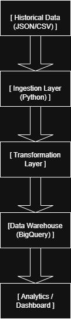

CommercePulse Case Study Data Pack

This folder contains:

1) Historical bootstrap data (JSON arrays):
   - data/bootstrap/orders_2023.json
   - data/bootstrap/payments_2023.json
   - data/bootstrap/shipments_2023.json
   - data/bootstrap/refunds_2023.json
   - data/fx_rates_2023.csv (optional extension)

2) Live event generator:
   - src/live_event_generator.py

Generate live events (JSONL) for a given day:
  python src/live_event_generator.py --out data/live_events --date 2025-01-15 --events 2000

Generate using today's date:
  python src/live_event_generator.py --out data/live_events --events 2000

Toggles:
  --dup-rate 0.05
  --late-rate 0.10
  --schema-drift-rate 0.15

Output:
  data/live_events/YYYY-MM-DD/events.jsonl

Notes:
- Historical data is intentionally inconsistent across vendors and missing stable event_ids.
- Live events include out-of-order arrivals, duplicates, schema drift, and bad references.

## Project Overview

commercepulse is a simulated event-driven data pipeline built to demonstrate ingestion, transformation, and warehouse modeling using historical and live event data.

## Architecture

## Tech Stack

-Python
-JSON
-BigQuery
Git & GitHub
-Event-drivrn ingestion simulation

## Data Layers

-Ingestion Layer: Raw event ingestion and deduplication
-Transformation Layer; Data Cleaning and normalization
-Warehouse Layer: Analytical fact and dimension tables
